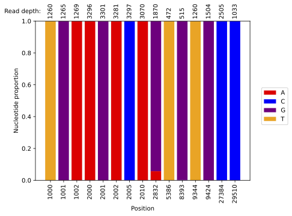

# bammix
Summarise nucleotide counts at a set of positions in a BAM file to search for mixtures



### Usage
```
usage: bammix -b bam_file.bam -p positions [options]

bammix

optional arguments:
  -h, --help            show this help message and exit
  -b BAM, --bam BAM     BAM file to be examined
  -p POSITIONS [POSITIONS ...], --positions POSITIONS [POSITIONS ...]
                        Set of positions to be checked
  -r REFERENCE, --reference REFERENCE
                        Name of reference the reads were mapped against, default MN908947.3
  -q BASE_QUALITY, --base_quality BASE_QUALITY
                        Minimum base quality to include a base in counts, default is to include all bases regardless of quality
  -m MAPPING_QUALITY, --mapping_quality MAPPING_QUALITY
                        Minimum mapping quality to include a read in counts, default is to include all reads
  -o O                  Optional prefix for output files, default is no prefix
```

### Install
```
pip install bammix
```
